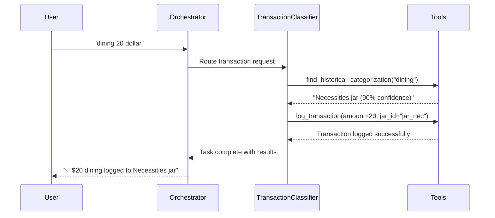

# AI Financial Coach - Multi-Agent System

A sophisticated multi-agent system built with LangGraph that provides intelligent financial coaching through conversational AI. The system uses specialized agents to handle different aspects of financial management, from budget jar operations to transaction logging and financial planning.

## 🏗️ Architecture

The system implements an **Orchestrator-Worker** pattern with the following agents:

- **🎯 Orchestrator Agent**: Central router that analyzes user intent and delegates to specialists
- **💰 JarManager Agent**: Handles budget jar CRUD operations
- **🏷️ TransactionClassifier Agent**: Parses and logs transactions intelligently  
- **🔄 FeeManager Agent**: Manages recurring fees and subscriptions
- **📊 BudgetAdvisor Agent**: Provides financial planning and goal-oriented advice
- **📚 KnowledgeBase Agent**: Answers general financial education questions

## 📁 Project Structure

```
agent/
├── agents/
│   ├── __init__.py
│   ├── orchestrator.py      # Central routing agent
│   └── workers.py           # Generic worker agent framework
├── tools/
│   ├── __init__.py
│   ├── jar_manager_tools.py
│   ├── transaction_classifier_tools.py
│   ├── fee_manager_tools.py
│   ├── budget_advisor_tools.py
│   ├── alerting_coach_tools.py
│   ├── insight_generator_tools.py
│   └── knowledge_base_tools.py
├── state.py                 # Graph state definition
├── graph.py                 # Main graph construction
├── main.py                  # CLI interface
├── requirements.txt
└── README.md
```

## 🚀 Getting Started

### Prerequisites

- Python 3.11 or newer
- Google AI API key (get one from [Google AI Studio](https://makersuite.google.com/app/apikey))

### Installation

1. **Clone and navigate to the directory:**
   ```bash
   cd agent/
   ```

2. **Install dependencies:**
   ```bash
   pip install -r requirements.txt
   ```

3. **Set up your Google AI API key:**
   ```bash
   export GOOGLE_API_KEY="your_api_key_here"
   ```
   Or set it when prompted by the application.

### Running the System

**Start the interactive CLI:**
```bash
python main.py
```

**Test graph functionality:**
```bash
python graph.py
```

## 💬 Usage Examples

Once running, you can interact with the AI Financial Coach using natural language:

### Budget Jar Management
```
💬 You: Add a Vacation jar with 10% allocation
🤖 AI Financial Coach: ✅ Created 'Vacation' jar with 10% allocation
```

### Transaction Logging  
```
💬 You: dining 25 dollar
🤖 AI Financial Coach: ✅ Logged $25 dining to Necessities jar. Remaining: $230
```

### Financial Education
```
💬 You: What is compound interest?
🤖 AI Financial Coach: Compound interest is the interest you earn on both your original money...
```

### Financial Planning
```
💬 You: I want to save for a trip to Japan
🤖 AI Financial Coach: 🇯🇵 I can help! Create Japan Trip jar saving $500/month...
```

## 🎮 CLI Commands

- **`demo`** - Run predefined examples showcasing agent routing
- **`help`** - Show detailed usage examples  
- **`quit`** or **`exit`** - Exit the application

## 🧠 How It Works

### Agent Routing Flow

1. **User Input** → **Orchestrator Agent**
2. **Intent Analysis** → **Route to Specialist Agent**
3. **Tool Execution** → **Task Completion**
4. **Response Synthesis** → **User Response**

### Example Flow: Transaction Logging



## 🔧 Key Features

### Intelligent Routing
- **Intent Recognition**: Automatically routes requests to appropriate specialist agents
- **Context Awareness**: Maintains conversation history and state
- **Error Handling**: Graceful fallbacks and user-friendly error messages

### Mocked Business Logic
- **Realistic Data**: Pre-populated with sample jars, transactions, and fees
- **Validation**: Proper business rule enforcement (e.g., percentage constraints)
- **State Management**: Consistent data handling across agent interactions

### Agent Specialization
- **Domain Expertise**: Each agent handles specific financial operations
- **Tool Access**: Agents only have access to tools relevant to their domain
- **Structured Communication**: Standardized data exchange between agents

## 🧪 Testing

The system includes comprehensive testing capabilities:

### Demo Mode
Run predefined examples to verify agent routing:
```bash
# In the CLI
demo
```

### Manual Testing
Test specific functionality:
```python
# Test graph creation
python graph.py

# Test individual tools
from tools.jar_manager_tools import get_all_jars
print(get_all_jars())
```

## 📊 Mock Data

The system comes with realistic mock data:

### Default Budget Jars
- **Necessities**: 55% ($2,750)
- **Long-Term Savings**: 10% ($500)  
- **Financial Freedom**: 10% ($500)
- **Education**: 10% ($500)
- **Play**: 10% ($500)
- **Give**: 5% ($250)

### Sample Transactions
- Starbucks coffee → Play jar
- Grocery shopping → Necessities jar
- Gas station → Necessities jar

### Recurring Fees
- Netflix subscription ($15.99/month)
- Gym membership ($50/month)

## 🔮 Future Enhancements

This is a prototype system. In a production environment, you would add:

- **Real Database Integration**: Replace mock data with persistent storage
- **Advanced AI Models**: More sophisticated NLP and decision-making
- **User Authentication**: Multi-user support with secure sessions  
- **API Endpoints**: REST API for web/mobile integration
- **Real Banking Integration**: Connect with actual financial institutions
- **Analytics Dashboard**: Visual reporting and insights
- **Mobile App**: Native mobile applications

## 🏆 VPBank Hackathon

This system was built for the VPBank Hackathon challenge: "AI Financial Coach – 6-Jar Money Management". Key differentiators:

- **Sophisticated Multi-Agent Architecture**: Advanced AI coordination patterns
- **Vietnamese Market Focus**: Designed for young Vietnamese users
- **Banking Integration Ready**: Architecture supports VPBank API integration
- **Scalable Design**: Built on AWS-compatible patterns for production deployment

## 📝 License

This project is a prototype built for the VPBank Hackathon. See individual dependencies for their respective licenses.

---

**Built with ❤️ using LangGraph, LangChain, and Google AI** 