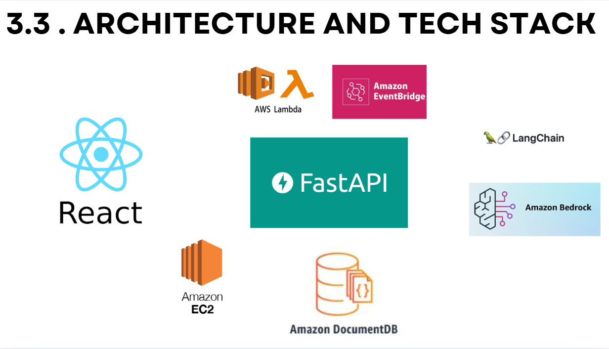

# VPBank Financial Coach Backend

## What is this folder?

This is the **backend** for a next-generation financial coaching chatbot, built on the proven "6-Jar" method by T. Harv Eker. It powers a multi-agent AI system that helps users manage their finances, track spending, plan budgets, and learn financial literacy—all with production-grade security, extensibility, and intelligence.

- **Multi-agent architecture**: Orchestrator, classifier, knowledge, plan, fee, jar, and transaction agents
- **6-Jar system**: Smart, flexible implementation of the classic budgeting method
- **AI-powered**: Natural language chat, automatic classification, and proactive financial advice

---

## Architecture Overview

```
┌─────────────────────────────────────────────────────────────┐
│                    Backend System Architecture              │
├─────────────────────────────────────────────────────────────┤
│  🌐 REST API Layer (FastAPI)                               │
│  ├── Authentication (JWT)                                   │
│  ├── Jar, Transaction, Fee, Plan, User Settings Endpoints   │
│  ├── AI Chat Interface (Orchestrator)                       │
├─────────────────────────────────────────────────────────────┤
│  🛠️ Service Layer (Business Logic)                         │
│  ├── JarManagementService, TransactionService, etc.         │
│  ├── OrchestratorService (AI Agent Bridge)                  │
│  ├── FinancialServices, Adapters, Security                  │
├─────────────────────────────────────────────────────────────┤
│  🗄️ Data Access Layer (MongoDB)                            │
│  ├── User, Jar, Transaction, Fee, Plan, Conversation, Lock  │
├─────────────────────────────────────────────────────────────┤
│  🤖 Agent System Integration                                │
│  ├── Orchestrator, Classifier, Knowledge, Plan, Fee, Jar    │
│  └── 100% compatible with original lab agents               │
└─────────────────────────────────────────────────────────────┘
```

- **Async-first**: All DB and service operations are async for performance
- **Modular**: Each feature is a separate service, agent, and API router
- **Orchestration**: The Orchestrator agent routes user requests to the right specialist agent

---
## Multi-agent system


## Tech Stack


## Detailed Features

### 🔐 Authentication
- JWT-based, secure registration/login
- Password hashing, user isolation, role-based access

### 🏺 Jar Management
- Full CRUD for budget jars (6-jar system, custom jars)
- Rebalancing, validation, percent/amount allocation
- Atomic multi-jar operations

### 💸 Transaction Management
- Intelligent classification (ReAct agent, context-aware)
- Advanced querying (by jar, date, amount, source)
- Auto-updates jar balances, analytics, and summaries

### 💳 Recurring Fees
- Pattern-based scheduling (daily, weekly, monthly)
- Target jar integration, next occurrence calculation
- Active/inactive status, deletion, and adjustment

### 📋 Budget Planning
- Goal setting, plan creation, status tracking
- Jar recommendation integration, progress monitoring

### 👤 User Settings
- Total income, preferences, configuration
- User-scoped, validated, and secure

### 💬 AI Chat (Multi-Agent)
- Orchestrator: routes, manages context, agent locks
- Classifier: ReAct-based, proactive info gathering
- Knowledge: app help, financial education
- Plan, Fee, Jar, Transaction agents: specialized logic

### 🗣️ Conversation History
- Persistent, agent-aware, context-rich
- Agent lock management for continuity

### 🔒 Security
- Password hashing, JWT, CORS, input validation
- User data isolation, environment-based config

### 🧩 Extensibility
- Adapter pattern for lab/legacy compatibility
- Modular services and agents for easy feature addition

---

## How to Run

### 1. Prerequisites
- Python 3.8+
- MongoDB (local or Atlas)
- Google API key (for AI chat)

### 2. Database
- Local: Install and start MongoDB
- Atlas: Create cluster, update MONGO_URL in .env

### 3. Run the Server
```bash
uvicorn backend.main:app --reload --host 0.0.0.0 --port 8000
# or
python -m backend.main
```

### 6. API Docs & Health Check
- [http://localhost:8000/docs](http://localhost:8000/docs)
- [http://localhost:8000/redoc](http://localhost:8000/redoc)
- [http://localhost:8000/](http://localhost:8000/) (health check)
